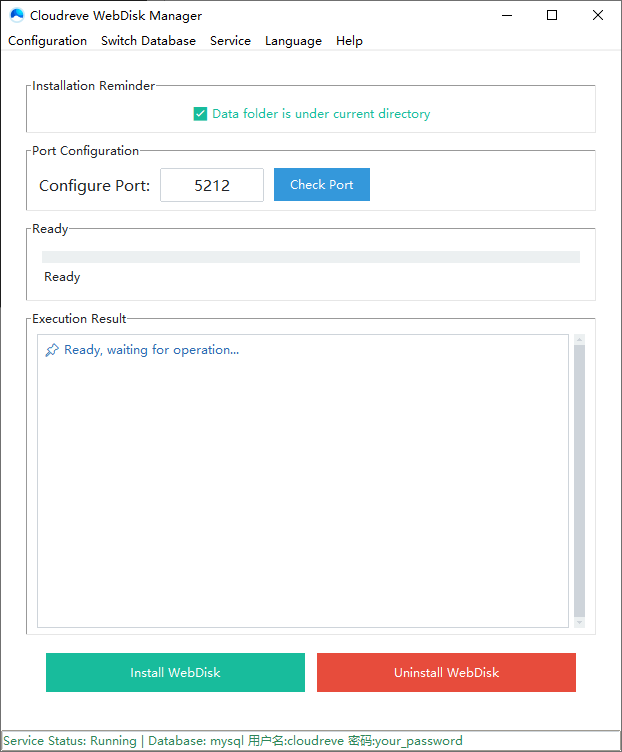

# cloudreve-manager

# Cloudreve 服务管理工具

一款专为 **Cloudreve** 网盘设计的 Windows 图形化管理工具，支持一键安装/卸载、服务启停、端口配置、防火墙规则、离开模式、自动/手动升级、MySQL 数据库配置及配置备份恢复。

## ✨ 功能特点

- **一键安装/卸载**：自动创建 Windows 服务，配置防火墙规则，启用系统离开模式
- **服务状态监控**：实时显示服务运行状态及数据库类型（SQLite/MySQL）
- **端口配置**：灵活修改监听端口，自动检测端口占用情况
- **自动/手动升级**：从 GitHub 获取最新版本自动更新，或手动选择升级文件
- **MySQL 支持**：自动检测 MySQL 服务，配置 Cloudreve 数据库，支持导出/导入 SQL 备份
- **配置备份与恢复**：备份配置文件及 SQLite 数据，可选 MySQL 导出，排除 uploads 目录
- **防火墙集成**：自动添加/删除 Windows 防火墙入站/出站规则
- **离开模式管理**：安装时自动启用离开模式，卸载时恢复，确保服务持续运行
- **高 DPI 适配**：自适应窗口大小，支持现代高分屏显示

## 📸 界面预览

 **

## 🚀 快速开始

### 环境要求

- Windows 7/8/10/11（64 位）
- 已安装 [Cloudreve](https://github.com/cloudreve/cloudreve) 程序文件（cloudreve.exe）
- 如需使用 MySQL，需安装 MySQL 8.0 或 5.7 并确保服务正常运行

### 安装步骤

1. 从 [Releases](https://github.com/wfkwdw/cloudreve-manager/releases) 下载最新版本的可执行文件（`CloudreveManager.exe`）。
2. 将 `CloudreveManager.exe`、`winsw.exe` 和 `winsw.xml` 放在同一个文件夹内。
3. **以管理员身份运行** `CloudreveManager.exe`。
4. 在界面中配置端口（默认 5212），点击“安装网盘”即可完成部署。
5. 安装完成后，工具会自动启动服务并打开网盘页面。

### 使用说明

- **启动/停止服务**：主界面右侧按钮会根据服务状态动态显示“启动服务”或“停止服务”。
- **修改端口**：在端口输入框中输入新端口，点击“检测端口”可检查是否可用，安装时会自动同步至配置文件。
- **打开网盘**：点击“打开网盘”按钮，工具会自动启动服务（如未运行）并打开浏览器访问网盘。
- **升级网盘**：点击“升级网盘”可选择“自动升级”（从 GitHub 拉取最新版）或“手动升级”（选择本地 cloudreve.exe 文件）。
- **MySQL 配置**：点击菜单“文件” → “安装 MySQL 数据库”，按照提示输入 root 密码，工具将自动创建数据库及用户，并更新配置文件。
- **配置备份/恢复**：通过菜单“文件”可备份/恢复配置文件（排除 uploads 目录），若数据库为 MySQL 则同时导出 SQL 文件。

## ⚙️ 配置文件说明

程序运行所需文件结构：

- `conf.ini` 中的 `[System]` 段下的 `Listen` 项控制服务监听端口。
- 
- 安装时会自动备份原配置文件为 `conf.ini.bak`。

## 🔧 高级功能

MySQL 数据库导出

在备份配置时，若检测到数据库类型为 MySQL，工具会自动调用 mysqldump 导出当前数据库的 SQL 文件，并打包进 ZIP 备份中。恢复时会将 SQL 文件复制到程序目录，供用户手动导入。

防火墙规则

安装时会创建名为 Cloudreve_Port_Inbound 和 Cloudreve_Port_Outbound 的防火墙规则，允许指定端口的 TCP 流量。卸载时会自动删除这些规则。

📝 常见问题

Q: 提示“需要管理员权限”怎么办？

A: 右键点击 CloudreveManager.exe，选择“以管理员身份运行”。首次安装或卸载时必须有管理员权限。

Q: 端口被占用无法安装怎么办？

A: 使用“检测端口”功能查看占用进程，若非 Cloudreve 进程，请更换端口或手动结束占用进程。

Q: 自动升级失败，提示网络错误？

A: 可能是 GitHub API 请求频率过高或被防火墙阻断，可尝试手动升级（选择本地文件）或稍后再试。

Q: 如何查看日志？

A: 程序运行时会输出日志到控制台（若以命令行启动），也可在 GUI 的“执行结果”区域查看详细输出。

🛠️ 开发与编译

环境准备

Python 3.6+

安装依赖：pip install ttkbootstrap

运行源码

python cloudreve_manager.py

打包为 EXE

使用 PyInstaller 打包：

pyinstaller -F -w -i cloudreve.ico ^
--add-data "C:\Users\admin\AppData\Local\Programs\Python\Python314\Lib\site-packages\ttkbootstrap;ttkbootstrap" ^
--add-data "cloudreve.ico;." ^
cloudreve_manager.py

📄 许可证

本项目基于 MIT 协议开源，详情请参阅 LICENSE 文件。

🙏 致谢

Cloudreve – 优秀的开源网盘系统

winsw – Windows 服务包装器

ttkbootstrap – 现代 tkinter 主题库

注意：本工具仅适用于 Windows 平台，且需要与 Cloudreve 主程序配合使用。使用前请确保已阅读并同意 Cloudreve 的许可协议。
